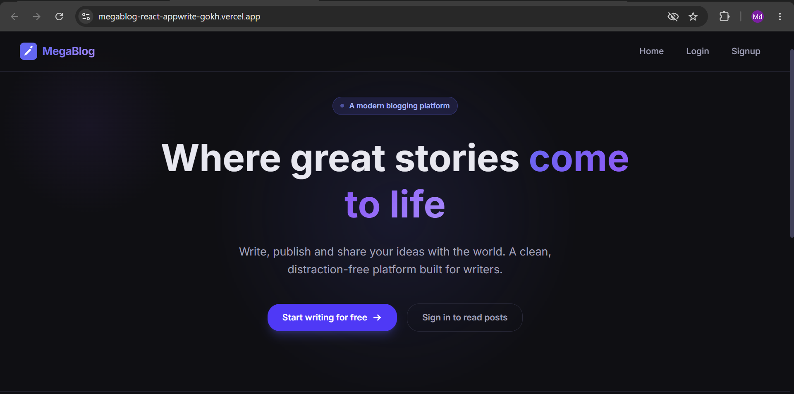
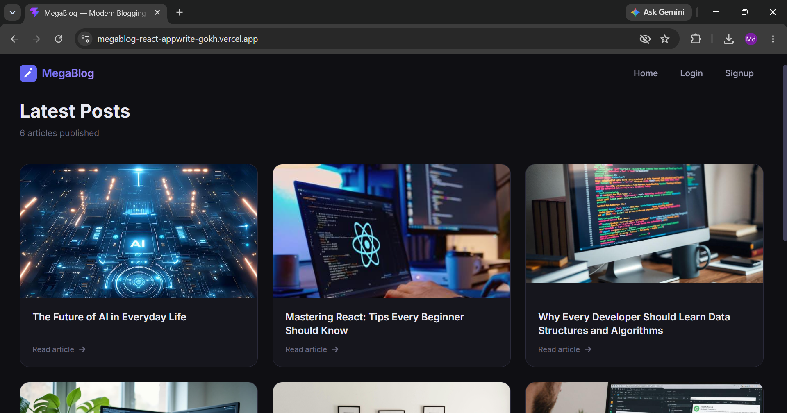
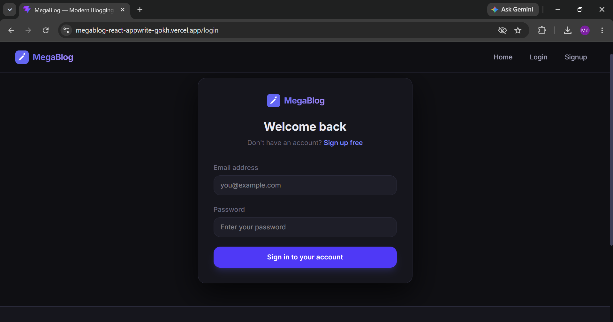
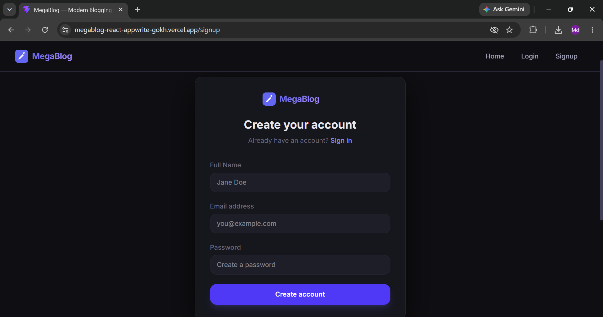
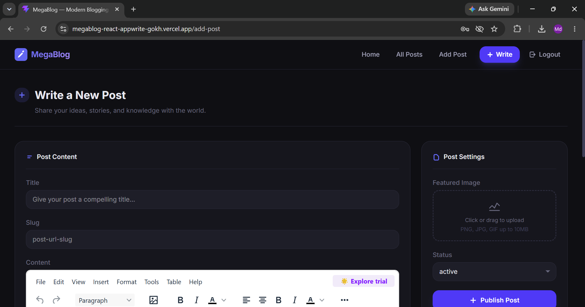
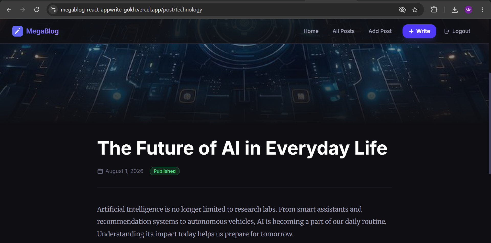

<div align="center">

# 📝 MegaBlog

### A modern full-stack blogging platform built with React, Appwrite and TinyMCE

[](https://react.dev/)
[](https://vitejs.dev/)
[](https://appwrite.io/)
[](https://tailwindcss.com/)
[](https://redux-toolkit.js.org/)
[](https://vercel.com/)

**[🚀 Live Demo](https://megablog-react-appwrite-gokh.vercel.app/) · [📦 Repository](https://github.com/altaf2834/megablog-react-appwrite) · [💼 LinkedIn](https://www.linkedin.com/in/md-altaf-a2bb90281/)**

</div>

<br/>



<br/>

## 📖 Overview

**MegaBlog** is a full-stack blogging platform where users can sign up, write, edit, and publish rich-text articles with images — all powered by a React frontend and an **Appwrite** backend (Authentication, Database, and Storage). It features protected routes, a Redux-driven auth flow, and a WYSIWYG editor via **TinyMCE**, wrapped in a clean, responsive, dark-themed UI.

This project was built to practice real-world full-stack patterns: authentication state management, protected routing, CRUD operations against a BaaS, file storage/upload, and production deployment.

<br/>

## ✨ Features

| Category | Details |
|---|---|
| 🔐 **Authentication** | Login, signup, and persistent sessions via Appwrite Auth |
| 🛡️ **Protected Routes** | Route guarding based on auth state (Redux) |
| ✍️ **Post Management** | Create, edit, and delete posts |
| 🎨 **Rich Text Editor** | TinyMCE-powered WYSIWYG editing experience |
| 🖼️ **Image Upload** | Featured images stored via Appwrite Storage |
| 🔀 **Dynamic Routing** | Slug-based routing for individual posts |
| 📱 **Responsive UI** | Fully responsive, mobile-friendly layout |
| 🌙 **Modern Dark UI** | Clean, minimal dark-themed design |
| 🗃️ **State Management** | Centralized app/auth state with Redux Toolkit |
| 🗄️ **Appwrite Database** | Posts stored and queried from Appwrite Collections |

<br/>

## 🖼️ Screenshots

<table>
  <tr>
    <td align="center"><b>Landing Page</b></td>
    <td align="center"><b>Latest Posts</b></td>
  </tr>
  <tr>
    <td></td>
    <td></td>
  </tr>
  <tr>
    <td align="center"><b>Login</b></td>
    <td align="center"><b>Signup</b></td>
  </tr>
  <tr>
    <td></td>
    <td></td>
  </tr>
  <tr>
    <td align="center"><b>Create Post (TinyMCE Editor)</b></td>
    <td align="center"><b>Single Post View</b></td>
  </tr>
  <tr>
    <td></td>
    <td></td>
  </tr>
</table>

> 💡 Place your screenshot files inside a `screenshots/` folder at the root of the repo, matching the filenames above (or update the paths to match your own).

<br/>

## 🛠️ Tech Stack

**Frontend**
- [React 18](https://react.dev/) — UI library
- [Vite](https://vitejs.dev/) — build tool & dev server
- [Tailwind CSS](https://tailwindcss.com/) — utility-first styling
- [Redux Toolkit](https://redux-toolkit.js.org/) — global state management
- [React Router DOM](https://reactrouter.com/) — client-side routing
- [React Hook Form](https://react-hook-form.com/) — form handling & validation

**Backend / BaaS**
- [Appwrite Authentication](https://appwrite.io/docs/products/auth) — user auth & sessions
- [Appwrite Database](https://appwrite.io/docs/products/databases) — post storage
- [Appwrite Storage](https://appwrite.io/docs/products/storage) — image/file storage

**Editor**
- [TinyMCE](https://www.tiny.cloud/) — rich text WYSIWYG editor

**Deployment**
- [Vercel](https://vercel.com/) — hosting & CI/CD

<br/>

## 🏗️ Architecture

```
                     React + Redux Toolkit
                             │
              React Router  +  Protected Routes
                             │
                       Appwrite SDK
              ┌──────────────┼──────────────┐
              │              │              │
          Auth API       Database        Storage
        (Login/Signup)  (Posts Coll.)  (Featured Images)
```

<br/>

## 🗃️ Database Schema (Appwrite — Posts Collection)

| Field | Type | Description |
|---|---|---|
| `$id` | string | Auto-generated document ID |
| `title` | string | Post title |
| `slug` | string | URL-friendly unique identifier |
| `content` | string (HTML) | Rich text content from TinyMCE |
| `featuredImage` | string | File ID referencing Appwrite Storage |
| `status` | enum | `active` / `inactive` (published/draft) |
| `userId` | string | ID of the post's author |

<br/>

## 📁 Folder Structure

```
src/
 ├── appwrite/       # Appwrite service classes (auth, db, storage)
 ├── components/     # Reusable UI components
 ├── pages/           # Route-level page components
 ├── store/           # Redux Toolkit slices & store config
 ├── conf/            # Environment/config setup
 └── assets/          # Static assets (images, icons)
```

<br/>

## ⚙️ Getting Started

### Prerequisites
- Node.js (v18+)
- An [Appwrite](https://appwrite.io/) account/project

### 1. Clone the repository
```bash
git clone https://github.com/altaf2834/megablog-react-appwrite.git
cd megablog-react-appwrite
```

### 2. Install dependencies
```bash
npm install
```

### 3. Configure environment variables
Copy `.env.example` to `.env` and fill in your Appwrite credentials:
```bash
cp .env.example .env
```

| Variable | Description |
|---|---|
| `VITE_APPWRITE_URL` | Your Appwrite API endpoint |
| `VITE_APPWRITE_PROJECT_ID` | Your Appwrite project ID |
| `VITE_APPWRITE_DATABASE_ID` | Database ID |
| `VITE_APPWRITE_COLLECTION_ID` | Posts collection ID |
| `VITE_APPWRITE_BUCKET_ID` | Storage bucket ID for images |
| `VITE_TINYMCE_API_KEY` | TinyMCE API key |

### 4. Run the development server
```bash
npm run dev
```
The app will be available at `http://localhost:5173`.

### 5. Build for production
```bash
npm run build
```

<br/>

## ☁️ Deployment

This project is deployed on **[Vercel](https://vercel.com/)** with automatic deployments on every push to `main`. The same environment variables from `.env` need to be added in the Vercel project settings.

**Live app:** [megablog-react-appwrite-gokh.vercel.app](https://megablog-react-appwrite-gokh.vercel.app/)

<br/>

## 🧩 Challenges Solved

- **Auth state management** — keeping login state in sync with Appwrite sessions using Redux
- **Protected routing** — redirecting unauthenticated users away from private routes
- **TinyMCE integration** — wiring a controlled rich-text editor into React Hook Form
- **Image upload flow** — uploading files to Appwrite Storage and linking them to posts
- **Environment variables** — managing Appwrite config safely across local/prod environments
- **React Router refresh issue** — fixing 404s on page refresh for client-side routes on Vercel
- **Appwrite CORS** — configuring allowed platforms/origins for local + production
- **Production deployment** — getting build + env config working correctly on Vercel

<br/>

## 🚧 Future Improvements

- [ ] Comments on posts
- [ ] Likes/reactions
- [ ] User profiles
- [ ] Post categories/tags
- [ ] Search functionality
- [ ] Bookmark/save posts
- [ ] Draft posts
- [ ] Pagination
- [ ] Social login (Google/GitHub)
- [ ] Email verification

<br/>

## 👤 Author

**Md Altaf**

- GitHub: [@altaf2834](https://github.com/altaf2834)
- LinkedIn: [md-altaf-a2bb90281](https://www.linkedin.com/in/md-altaf-a2bb90281/)
- Live Project: [megablog-react-appwrite-gokh.vercel.app](https://megablog-react-appwrite-gokh.vercel.app/)

<br/>

<div align="center">

If you found this project interesting, consider giving it a ⭐ on [GitHub](https://github.com/altaf2834/megablog-react-appwrite)!

</div>
